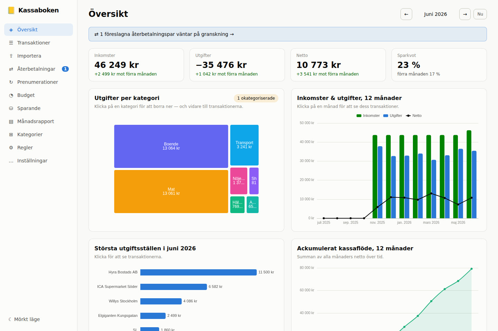

# 📒 Kassaboken

**Lokal privatekonomi-dashboard som ersätter trötta Excelark.** Importera kontoutdrag och
kreditkortsexporter, kategorisera en gång — appen minns till nästa gång — och få stenkoll via
diagram med drill-down, prenumerationsdetektering, budget och sparandeuppföljning.

All data lagras lokalt i en SQLite-databas på din dator. Ingenting lämnar din maskin.



## Funktioner

- **Import av CSV/Excel** från svenska banker — Swedbank, SEB, Nordea, Handelsbanken,
  ICA Banken, Avanza, Amex m.fl. Hanterar automatiskt semikolon/komma, decimalkomma,
  Windows-1252/UTF-8, metadatarader före tabellen och kreditkort som listar köp positivt.
- **Mappningsguide med minne**: okända filformat får en guide första gången — kolumnvalen
  sparas per formatlayout (fingeravtryck) och nästa import är helt automatisk.
- **Kategorisering som lär sig**: när du kategoriserar föreslås en regel som direkt
  appliceras på liknande transaktioner och alla framtida importer. Manuella val skrivs
  aldrig över.
- **Korrekt dubbletthantering**: importera överlappande exporter månadsvis eller mer
  sällan — dubbletter exkluderas exakt, samtidigt som två identiska köp samma dag bevaras.
  Varje import kan ångras i efterhand.
- **Smart kvittning**: återbetalningar och kontoöverföringar matchas automatiskt till par
  som nettas ur statistiken, så ett återköp inte ser ut som både utgift och inkomst.
- **Dashboard med drill-down**: översikt → kategori → underkategori → transaktionslista.
  Varje diagramklick leder till de underliggande transaktionerna.
- **Prenumerationsdetektering**: återkommande utgifter hittas automatiskt med rytm,
  årskostnad och nästa förväntade dragning.
- **Budget & prognos**: månadsbudget per kategori med utfall, plus riktvärden baserade på
  vad kategorierna faktiskt brukar kosta.
- **Sparande med driftkoll**: uppdatera konto-/depåvärden manuellt, följ utvecklingen och
  se drift mot din målfördelning i både procentenheter och kronor.
- **Månadsrapport** (utskriftsvänlig), global sök/filter, CSV-export, mörkt/ljust tema.

## Kom igång

Kräver [Python 3.11+](https://www.python.org/downloads/) och [Node.js 20+](https://nodejs.org/)
(Node behövs bara första gången, för att bygga gränssnittet).

```bash
git clone https://github.com/s6410/legendary-potato.git
cd legendary-potato
pip install -e ./backend
python run.py
```

`run.py` bygger gränssnittet vid behov, startar servern på `http://127.0.0.1:8014` och öppnar
webbläsaren. Fungerar likadant på Windows, macOS och Linux.

Databasen hamnar i din användardatamapp (`~/.local/share/kassaboken/` på Linux,
`~/Library/Application Support/kassaboken/` på macOS, `%APPDATA%\kassaboken\` på Windows).
Säkerhetskopiera genom att kopiera filen `kassaboken.db`. Sätt miljövariabeln `KASSABOKEN_DB`
för egen placering.

### Första importen

1. Exportera transaktioner från din internetbank (CSV eller Excel).
2. Släpp filen på **Importera**-sidan.
3. Okänt format? Guiden visar filens kolumner med exempelrader — peka ut datum, beskrivning
   och belopp, välj konto. Valen sparas.
4. Granska förhandsvisningen (nya/dubbletter/auto-kategoriserade) och bekräfta.
5. Kategorisera transaktionerna och kryssa i "Skapa regel" — nästa import sköter sig själv.

## Utveckling

```bash
# Backend med tester
pip install -e './backend[dev]'
cd backend && pytest

# Frontend i dev-läge (hot reload, proxy mot backend)
python run.py --dev            # terminal 1: API på :8014
cd frontend && npm run dev     # terminal 2: Vite på :5173
```

Arkitektur: FastAPI + SQLAlchemy + SQLite (belopp lagras som heltal i ören, alla
aggregat i `backend/app/services/`), React + TypeScript + Tailwind + ECharts
(`frontend/src/`). Testerna drivs av fixturfiler som efterliknar riktiga svenska
bankexporter, inklusive teckenkodnings- och formatfällorna.
